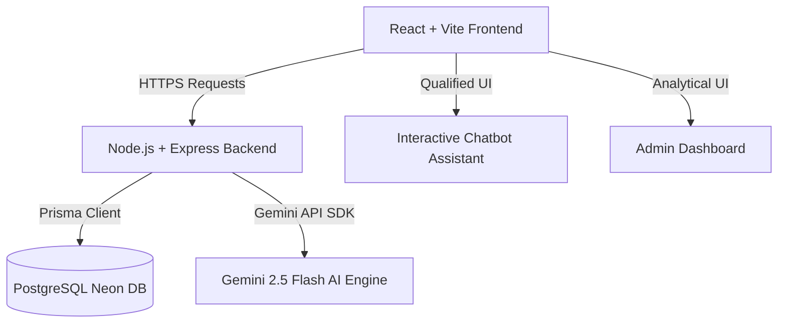

# Venturizer – AI-Powered Lead Qualification System

Venturizer is an intelligent, high-performance lead qualification chatbot and administrative dashboard designed to collect structured business insights from startup founders and venture investors, evaluate submission quality, score leads dynamically, and summarize submissions.

The platform uses a hybrid qualification approach:
- **Client-Side Form Validation:** Validates base inputs and constraints in real time.
- **AI-Powered Quality Auditing:** Validates descriptive answers via Gemini 2.5 Flash to block low-effort keyboard smashing, spam, and gibberish.
- **Hybrid Scoring Engine:** Combines structured profiles, LinkedIn profile completeness, and AI quality scores to rate leads (0-100) and place them in qualification tiers (**HOT**, **GOOD**, **MAYBE**, **LOW**).
- **Automated Summary Analysis:** Generates structured SWOT profiles (summary, strengths, weaknesses, and actionable recommendations) to save analysts from reading long transcripts manually.

---

## Architecture Diagram



---

## Features

### 1. Interactive Qualification Chatbot
- Custom step-by-step chat flow customized for **Founders** and **Investors**.
- Supports back-navigation (`← Back` button) to revisit and edit answers.
- Real-time field validation matching HTML5 formats (e.g., Email, LinkedIn URL, Numbers).

### 2. Real-Time Gemini AI validation
- Evaluates long-form inputs (e.g. Founder Background, Investor Thesis) immediately upon entry.
- Detects gibberish, spam, character repetitions, fake company names, and meaningless phrases.
- Returns clear errors on validation failure: `"Please enter a meaningful answer."` and prevents progress.

### 3. Lead Scoring Engine
- Evaluates leads using a 100-point rubric.
- Distributes points across structured attributes (e.g., MVP Completion, Team size, Cheque sizes, LinkedIn profile presence) and AI-assessed text quality.
- Categorizes leads into tiers:
  - **HOT**: Score ≥ 80
  - **GOOD**: 60 ≤ Score < 80
  - **MAYBE**: 40 ≤ Score < 60
  - **LOW**: Score < 40

### 4. Admin Dashboard
- Displays key aggregation cards: Total Leads, Founders, Investors, Hot/Good/Maybe counts, and Average Lead Score.
- Shows submission activity charts and lead distribution metrics.
- Provides search (by name, email, company) and dropdown filter capabilities.
- Detail page containing a visual Score Breakdown bar chart, Profile grid, complete conversation transcripts, and the AI Analysis panel.

### 5. Robust Fallback Support
- Gracefully handles Gemini key absence, timeout, or network failures.
- Logs `GEMINI FALLBACK ACTIVATED` on the backend terminal.
- Uses smart fallbacks (e.g. quality score: `5`) and dynamically generates a personalized profile summary so that the application never breaks.

---

## Technology Stack

### Frontend
- **Framework:** React 18, Vite
- **Routing:** Component-based layout state
- **Icons & Styling:** Custom CSS, SVG icons, Google Fonts (Outfit, Inter)

### Backend
- **Server:** Node.js + Express
- **ORM:** Prisma v5
- **Database:** PostgreSQL (Neon Serverless)
- **Validation:** Zod schemas
- **AI Integration:** Google Generative AI SDK (`gemini-2.5-flash`)

---

## Folder Structure

```
venturizer/
├── backend/
│   ├── prisma/
│   │   ├── migrations/      # SQL database migrations
│   │   └── schema.prisma    # Database schema definition
│   ├── src/
│   │   ├── config/          # Environment configuration
│   │   ├── controllers/     # Route controller functions
│   │   ├── database/        # Prisma client initialization
│   │   ├── middleware/      # Error handler and security
│   │   ├── routes/          # API route definitions
│   │   ├── services/        # Gemini AI, scoring, and lead database logic
│   │   ├── utils/           # Input sanitizers and HTTP error helpers
│   │   ├── validators/      # Zod validation schemas
│   │   └── server.js        # Application entry point
│   ├── .env                 # Backend environment variables
│   └── package.json
├── frontend/
│   ├── src/
│   │   ├── api/             # API client methods
│   │   ├── components/      # Chatbot and Dashboard components
│   │   ├── data/            # Chat questions metadata
│   │   ├── utils/           # Frontend validation helpers
│   │   ├── App.css
│   │   ├── App.jsx
│   │   └── index.css
│   ├── vite.config.js
│   └── package.json
└── README.md
```

---

## Environment Variables

### Backend (`backend/.env`)
Create a file named `.env` in the `backend/` directory with the following variables:

```env
DATABASE_URL="postgresql://<username>:<password>@<host>/neondb?sslmode=require"
PORT=4000
CLIENT_URL=http://localhost:5173
DASHBOARD_SECRET="replace-with-a-long-random-string"
GEMINI_API_KEY="your-gemini-api-key"
```

---

## Installation & Setup

### Prerequisites
- Node.js (v18 or higher)
- npm or yarn
- A PostgreSQL database (e.g., Neon.tech account)

### 1. Database Setup & Migration
1. Navigate to the backend directory:
   ```bash
   cd backend
   ```
2. Install backend dependencies:
   ```bash
   npm install
   ```
3. Run database migrations:
   ```bash
   npx prisma migrate dev
   ```

### 2. Backend Local Run
Start the Express server in development mode:
```bash
npm run dev
```
The backend server runs by default on `http://localhost:4000`.

### 3. Frontend Local Run
1. Open a new terminal and navigate to the frontend directory:
   ```bash
   cd ../frontend
   ```
2. Install frontend dependencies:
   ```bash
   npm install
   ```
3. Start the Vite dev server:
   ```bash
   npm run dev
   ```
The frontend dev server runs by default on `http://localhost:5173`.

---

## API Overview

### Leads
- `GET /api/leads` – Fetch all leads with filters (`type`, `status`, `search`) and pagination (`page`, `limit`).
- `GET /api/leads/:id` – Fetch a detailed lead record, including profiles, answers, scores, and AI summaries.
- `POST /api/leads` – Create a new lead from a completed chatbot session.
- `PATCH /api/leads/:id/status` – Update the administrative status of a lead.
- `POST /api/leads/validate-answer` – Run real-time Gemini evaluation on a text field answer before saving it.

### Dashboard
- `GET /api/dashboard` – Fetch aggregated lead counts, charts data, and recent submissions.

---

## AI Scoring Workflow

When a lead is submitted:
1. **Gibberish Filtering:** If any long-form answer is detected as gibberish during the chat flow, the chatbot blocks the user immediately.
2. **Backend scoring request:** The backend receives the profile parameters and responses.
3. **Gemini quality audit:** The backend runs AI checks on all descriptive text fields, rating quality from `0` to `10`.
4. **Calculated Lead Score:** The rule-based engine calculates points for structural fields (e.g., founder has an MVP = 20 pts) and factors in the quality scores from the AI audit.
5. **Tier Allocation:** The final score determines if the status is **HOT**, **GOOD**, **MAYBE**, or **LOW**.
6. **SWOT Generation:** Gemini analyzes the structured inputs and answers to output a SWOT report, saving it as `AiSummary`.

---

## Deployment Instructions

### Database
- Use a managed PostgreSQL service such as Neon, Supabase, or AWS RDS. Run `npx prisma db push` or `npx prisma migrate deploy` in your production pipeline.

### Backend (Node/Express)
- Deploy to platforms like Render, Railway, Heroku, or AWS App Runner.
- Ensure the production environment variables (`DATABASE_URL`, `GEMINI_API_KEY`, `PORT`, `DASHBOARD_SECRET`, `CLIENT_URL`) are configured in the platform's settings dashboard.

### Frontend (React/Vite)
- Build the production assets: `npm run build`.
- Deploy the resulting `dist/` folder to Vercel, Netlify, Render, or AWS S3. Configure redirects for single-page routing (SPA).

---

## Future Improvements
- **Bulk Lead Export:** Export lead profiles and AI evaluations to CSV/JSON format.
- **Email Notifications:** Automatically email analysts when a lead receives a **HOT** score.
- **Deeper LinkedIn Validation:** Retrieve profile data via official API integrations instead of evaluating URL presence.

---

## Author
* **Project Team** – Built for automated investor-founder matching.