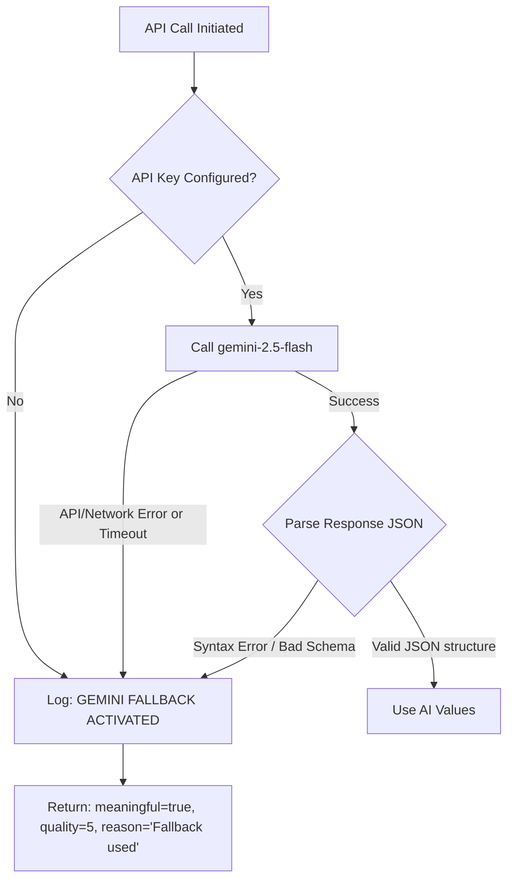

# AI & Hybrid Lead Scoring Documentation

This document explains the design, methodology, and integration of the Venturizer Lead Scoring Engine. It outlines how rule-based heuristics and Generative AI collaborate to assess submission completeness and verify information quality.

---

## 1. Executive Summary: Why Hybrid?

### Why AI is Used
Traditional form scoring evaluates structural completeness, checking properties like character count, field presence, or checklist values. However, this is easily bypassed by meaningless text entry (e.g. typing `"asdfasdfasdf"` or repeating characters like `"aaaaaaa"`). Generative AI (Gemini 2.5 Flash) is integrated to audit text quality, ensuring descriptions contain real business details.

### Why Rule-Based Scoring Exists
While AI is powerful, it is computationally expensive, non-deterministic, and subject to rate limits or connection timeouts. Relying entirely on AI makes system performance fragile. A rule-based framework provides a structured backbone, scoring concrete quantitative metrics (e.g. founder commitment, cheque range, team size, MVP completion) consistently.

### The Hybrid Solution
Our system operates as a hybrid engine:
- **Base Scoring Framework:** Structured data attributes are evaluated using a strict, rule-based rubric.
- **AI-Driven Quality Discounts:** Descriptive text fields (e.g., background, problem, customer, thesis) are validated by Gemini, receiving a quality score (0 to 10). If the quality is low, the points allocated for that field are discounted.
- **Resilient Fallback:** If the AI model fails or is unconfigured, the system defaults to a baseline quality score (e.g., 5) without interrupting the user.

---

## 2. Technical Evaluation Rubrics

The final qualification score is a cumulative sum of points across distinct criteria, capping at a maximum of **100 points**.

### Founder Evaluation Rubric (Max: 100 Points)

| Category | Criterion | Max Points | Scoring Rules |
| :--- | :--- | :---: | :--- |
| **Founder Profile** | Founder Background | **15** | AI-Evaluated Quality (0 to 10) scaled: `(quality / 10) * 15` |
| **Problem & Market**| Problem Clarity | **15** | AI-Evaluated Quality (0 to 10) scaled: `(quality / 10) * 15` |
| **Startup Profile**  | Startup Description | **10** | AI-Evaluated Quality (0 to 10) scaled: `(quality / 10) * 10` |
| **Target Customer** | Target Customer | **10** | AI-Evaluated Quality (0 to 10) scaled: `(quality / 10) * 10` |
| **Product Stage**   | MVP Status | **20** | `COMPLETED` = 20 pts \| `IN_PROGRESS` = 10 pts \| `IDEA` = 2 pts |
| **Traction Status**  | Traction Metrics | **15** | AI-Evaluated Quality (0 to 10) scaled: `(quality / 10) * 15` |
| **Team Structure**  | Team Dynamics | **15** | `teamSize > 1` = +10 pts (else 5 pts) <br> `teamFullTime == YES` = +5 pts |
| **Social Presence**  | LinkedIn Profile | **5** | URL starts with `linkedin.com` = 5 pts (else 0 pts) |

---

### Investor Evaluation Rubric (Max: 100 Points)

| Category | Criterion | Max Points | Scoring Rules |
| :--- | :--- | :---: | :--- |
| **Investment Thesis** | Investment Thesis | **20** | AI-Evaluated Quality (0 to 10) scaled: `(quality / 10) * 20` |
| **Sector Focus**     | Sector Alignment | **15** | AI-Evaluated Quality (0 to 10) scaled: `(quality / 10) * 15` |
| **Stage Focus**      | Stage & Setup | **15** | stageFocus declared = 10 pts <br> leadOrFollow declared = 5 pts |
| **Cheque Setup**     | Cheque Size | **10** | chequeSize > 0 = 5 pts <br> chequeRange declared = 5 pts |
| **Portfolio History** | Current Portfolio | **15** | AI-Evaluated Quality (0 to 10) scaled: `(quality / 10) * 15` |
| **Operational Help**  | Support Model | **10** | AI-Evaluated Quality (0 to 10) scaled: `(quality / 10) * 10` |
| **Firm Profile**     | Credibility Profile | **10** | LinkedIn URL present = +5 pts <br> firmName & roleAtFirm present = +5 pts |
| **Capital Status**   | Capital Availability | **5** | capitalAvailable == `AVAILABLE` = 5 pts (else 0 pts) |

---

## 3. Lead Status Mapping

Once the cumulative score is calculated, the lead is assigned a status tier:

```
[Score: 0] ------------------- [Score: 40] ------------------- [Score: 60] ------------------- [Score: 80] ------------------- [Score: 100]
     |                              |                              |                              |                              |
     +------------ LOW -------------+----------- MAYBE ------------+------------ GOOD ------------+------------ HOT -------------+
```

- **HOT** (Score ≥ 80): Immediate priority. High quality metrics, clear MVP traction, and structured backing.
- **GOOD** (60 ≤ Score < 80): Solid lead. Good domain quality, though missing some milestones like a live MVP.
- **MAYBE** (40 ≤ Score < 60): Needs review. Text details are sparse or the product is at the concept phase.
- **LOW** (Score < 40): Spam or low-quality submission. High amount of unstructured or shallow responses.

---

## 4. Fallback Architecture

To ensure high availability, the backend employs a robust fallback wrapper for every Gemini API request:



This guarantees that:
- Network anomalies, rate limits, or credentials issues do not crash the Express server.
- The client-side form remains fully functional.
- The lead is saved using middle-tier scores rather than failing the transaction.
