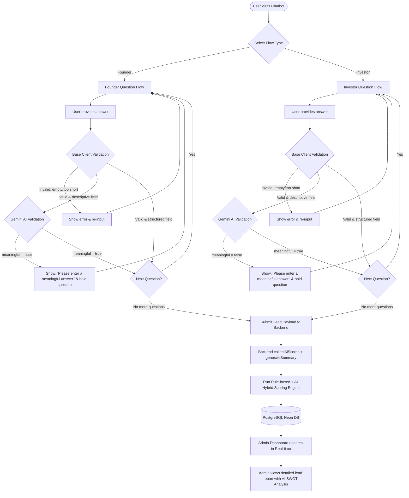

# Conversation Flow Diagram

This document describes the step-by-step logic of the user's journey through the Venturizer Qualification Chatbot and its connection to the lead evaluation and dashboard layers.

---

## 1. Complete Workflow Diagram

The flow charts the path of a user from starting the chat to being scored, stored, and analyzed by the admin.



---

## 2. PNG-Friendly Plaintext Workflow Diagram

For rendering engines that prefer standard structural representation:

```
[User starts Chatbot]
       |
       v
[Select Flow Type: Founder or Investor]
       |
       +---> [Founder Questions] <---+
       |            |                 | (If Validation Fails)
       |            v                 |
       |     [Base Local Validation]--+
       |            | (Passes)
       |            v
       |     [Gemini AI Check] -------+ (If meaningful == false)
       |            | (Passes)
       |            v
       |     [Save Temp Answer]
       |
       +---> [Investor Questions] <--+
                    |                 | (If Validation Fails)
                    v                 |
             [Base Local Validation]--+
                    | (Passes)
                    v
             [Gemini AI Check] -------+ (If meaningful == false)
                    | (Passes)
                    v
             [Save Temp Answer]
                    |
                    v
          (All Questions Answered)
                    |
                    v
        [Submit Payload to Backend]
                    |
                    v
        [Process AI Scores & Summary]
                    |
                    v
        [Calculate Hybrid Qualification Score]
                    |
                    v
        [Save Record to Database (Neon)]
                    |
                    v
        [Admin reviews Lead Detail & SWOT on Dashboard]
```
