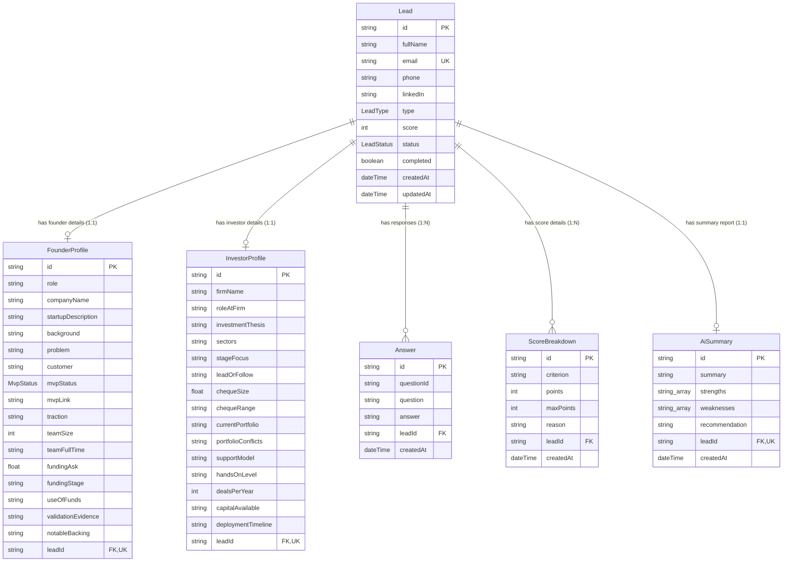

# Database Schema Documentation

This document describes the Prisma schema design, the purpose of each table, its relational constraints, indexes, enums, and a database Entity-Relationship (ER) diagram.

---

## 1. Entity-Relationship (ER) Diagram

---

## 2. Table Documentation

### Table: `Lead`
- **Purpose**: Serves as the central entity for every qualified submission. It holds base contact credentials, final qualification score, status tier, and acts as the relational anchor for profile details, transcripts, score breakdowns, and AI summaries.
- **Fields**:
  - `id` (String, Primary Key, CUID): Unique identifier.
  - `fullName` (String): The submitter's full name.
  - `email` (String, Unique): Submitter's email address.
  - `phone` (String): Submitter's phone number.
  - `linkedIn` (String, Nullable): Submitter's LinkedIn profile link.
  - `type` (LeadType, Enum): Either `FOUNDER` or `INVESTOR`.
  - `score` (Int, Default: 0): Overall lead qualification score (0-100).
  - `status` (LeadStatus, Enum, Default: `MAYBE`): Qualification tier (`HOT`, `GOOD`, `MAYBE`, `LOW`).
  - `completed` (Boolean, Default: false): Indicates if the chatbot flow was completed.
  - `createdAt` (DateTime, Default: `now()`): Creation timestamp.
  - `updatedAt` (DateTime): Auto-updated modification timestamp.
- **Indexes**: Implied unique constraint index on `email`.

---

### Table: `FounderProfile`
- **Purpose**: Stores structured business profiles for Founder leads. Contains business dimensions, MVP status, funding parameters, and traction metrics.
- **Fields**:
  - `id` (String, Primary Key, CUID): Unique identifier.
  - `role` (String): Submitter's role (e.g. Co-founder & CEO).
  - `companyName` (String): Startup name.
  - `startupDescription` (String): One-line elevator pitch.
  - `background` (String): Founder professional background.
  - `problem` (String): Description of the problem solved.
  - `customer` (String): Target buyer persona details.
  - `mvpStatus` (MvpStatus, Enum): `IDEA`, `IN_PROGRESS`, or `COMPLETED`.
  - `mvpLink` (String, Nullable): Product or mockup web link.
  - `traction` (String, Nullable): Active users, revenue, or milestones description.
  - `teamSize` (Int, Nullable): Core team count.
  - `teamFullTime` (String, Nullable): Indicates full-time commitment.
  - `fundingAsk` (Float, Nullable): Target funding amount.
  - `fundingStage` (String, Nullable): Investment round target.
  - `useOfFunds` (String, Nullable): Planned expenditure breakdown.
  - `validationEvidence` (String, Nullable): Letter of Intent or user feedback.
  - `notableBacking` (String, Nullable): Grant, incubator, or angel backer details.
  - `leadId` (String, Unique, Foreign Key): Links to `Lead.id`. Enables cascade delete.

---

### Table: `InvestorProfile`
- **Purpose**: Stores structured parameters for Investor leads, including ticket sizes, focus areas, and available capital.
- **Fields**:
  - `id` (String, Primary Key, CUID): Unique identifier.
  - `firmName` (String): Name of the VC firm or syndicate.
  - `roleAtFirm` (String): Role title (e.g., General Partner).
  - `investmentThesis` (String): Overview of investment thesis.
  - `sectors` (String): Active industries target.
  - `stageFocus` (String): Stage preference (e.g. Pre-Seed, Series A).
  - `leadOrFollow` (String): Round participation preference (Lead or Follower).
  - `chequeSize` (Float, Nullable): Average ticket size.
  - `chequeRange` (String, Nullable): Ticket minimum and maximum range.
  - `currentPortfolio` (String, Nullable): Existing investment examples.
  - `portfolioConflicts` (String, Nullable): Conflicting startup investment declarations.
  - `supportModel` (String): Non-capital assistance details.
  - `handsOnLevel` (String): Level of operational involvement.
  - `dealsPerYear` (Int, Nullable): Number of investments per year.
  - `capitalAvailable` (String): Available capital status (e.g., `AVAILABLE` or `NOT_AVAILABLE`).
  - `deploymentTimeline` (String): Timeline for deployment.
  - `leadId` (String, Unique, Foreign Key): Links to `Lead.id`. Enables cascade delete.

---

### Table: `Answer`
- **Purpose**: Keeps a complete chronological Q&A history representing the conversation transcript.
- **Fields**:
  - `id` (String, Primary Key, CUID): Unique identifier.
  - `questionId` (String): Identifier of the question (e.g. `fullName`).
  - `question` (String): Question prompt.
  - `answer` (String): Submitter response.
  - `leadId` (String, Foreign Key): Links to `Lead.id`. Cascade deletes.
  - `createdAt` (DateTime, Default: `now()`): Timestamp.

---

### Table: `AiSummary`
- **Purpose**: Stores the generated SWOT summary report, listing core strengths, gaps/weaknesses, and analyst recommendations.
- **Fields**:
  - `id` (String, Primary Key, CUID): Unique identifier.
  - `summary` (String): Executive summary text.
  - `strengths` (String Array): Key positive indicators.
  - `weaknesses` (String Array): Areas of risk or missing information.
  - `recommendation` (String): Actionable next step.
  - `leadId` (String, Unique, Foreign Key): Links to `Lead.id`. Cascade deletes.
  - `createdAt` (DateTime, Default: `now()`): Creation timestamp.

---

### Table: `ScoreBreakdown`
- **Purpose**: Retains the itemized point distribution generated by the scoring engine for the admin dashboard.
- **Fields**:
  - `id` (String, Primary Key, CUID): Unique identifier.
  - `criterion` (String): Scored category name (e.g. `Founder Background`).
  - `points` (Int): Awarded score.
  - `maxPoints` (Int): Maximum possible score.
  - `reason` (String): Rationale justifying the score.
  - `leadId` (String, Foreign Key): Links to `Lead.id`. Cascade deletes.
  - `createdAt` (DateTime, Default: `now()`): Creation timestamp.

---

## 3. Enums

### `LeadType`
- `FOUNDER`: Startup founder submission.
- `INVESTOR`: VC/Angel investor submission.

### `LeadStatus`
- `HOT`: Score ≥ 80
- `GOOD`: 60-79
- `MAYBE`: 40-59
- `LOW`: < 40

### `MvpStatus`
- `IDEA`: Project is at the conceptual phase.
- `IN_PROGRESS`: Product is under development.
- `COMPLETED`: Live product or prototype exists.
