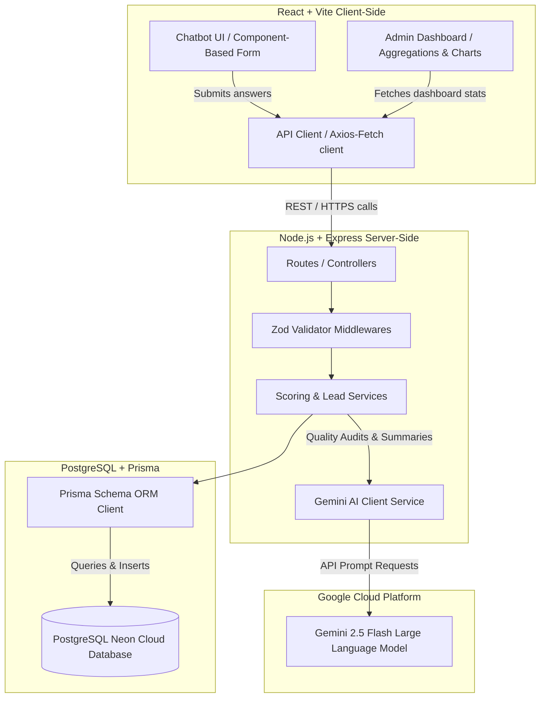

# System Architecture

This document details the multi-tiered architecture of the Venturizer Lead Qualification System.

---

## 1. High-Level Architecture Diagram

---

## 2. Layer Analysis

### A. Frontend Layer (React + Vite Client)
- **Component Architecture:** Formed of discrete functional modules. Key modules include `Chatbot.jsx`, `LeadList.jsx`, `LeadDetail.jsx`, and `DashboardHome.jsx`.
- **State Management:** Employs React state hooks (`useState`, `useEffect`) and references (`useRef`) to run step-by-step chat wizard progressions and paginate dashboard tables.
- **Form & Input Composer:** `ChatComposer.jsx` renders inputs and textareas dynamically based on metadata defined in `founderQuestions.js` and `investorQuestions.js`.
- **Validation Guard:** Prevents moving to the next question if input formats (e.g. email patterns) fail client checks. If the field is AI-validated, it calls the backend validate endpoint to check content quality before advancing.

### B. Backend Layer (Node.js + Express API Server)
- **Routing & Controllers:** Routes requests through organized routers (`lead.routes.js`, `dashboard.routes.js`) which forward to controller handlers (`lead.controller.js`, `dashboard.controller.js`).
- **Zod Schema Validation:** Intercepts write requests (e.g., creating a lead) using Zod validator middleware to enforce schema formats and strip out unsanitized inputs.
- **Service Layer Orchestration:** Coordinates core business logic:
  - `lead.service.js`: Manages transactions, retrieves lead records, and handles CRUD operations.
  - `gemini.service.js`: Interacts with Google's Generative AI SDK, structuring prompts and parsing responses.
  - `scoring.service.js`: Computes the hybrid qualification score based on user details and Gemini audits.

### C. Database & ORM Layer (Prisma + PostgreSQL Neon)
- **ORM abstraction:** The Prisma client (`prisma.js`) abstracts raw SQL queries into clean JavaScript methods. It also ensures type safety based on definitions in `schema.prisma`.
- **Serverless PostgreSQL (Neon):** Neon hosts our database instances. Connection pooling is enabled to manage serverless functions and dynamic API requests cleanly.
- **Cascading Constraints:** Deleting a `Lead` record cascades to remove associated profiles, Q&A answers, score breakdowns, and AI summaries automatically.

### D. Artificial Intelligence Layer (Gemini 2.5 Flash)
- **API Model:** Uses `gemini-2.5-flash` with JSON output formatting configured (`responseMimeType: "application/json"`).
- **Substantive Quality Audit:** Evaluates long text responses to detect low-effort typing (like "asdfasdf") and return quality scores.
- **Executive Summaries:** Generates concise structured summaries containing strengths, weaknesses, and actionable recommendations based on submission context.
